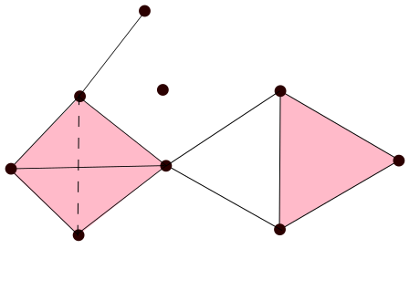

## Overview

To round off day 1, we will combine what you learned in the first two sessions to cover
the basics of computational topology. After learning the requisite theory,
we will present relevant examples in R for students to gain hands on experience.

This session is presented jointly by Brittany and Ben. Brittany will cover most of the
theory, and Ben will lead R programming sections.

### Objectives

After this session, we hope that you will  be able to:

> - Understand how topological shape can exist in data
> - Gain a working knowledge of persistence barcodes and diagrams
> - Gain exposure to the Vietoris-Rips and other complexes
> - Know how to begin the topological data analysis pipeline in R
> - Know how to conduct the Vietoris-Rips and the height filtration in R

---

## Getting Started

We begin this session by introducing simplicial complexes, which are 
a type of data that holds intrinsic topological meaning.

---

### Triangle appreciation

Of course we are all familiar with triangles, and to understand the Rips filtration, we must first conceptualize triangles of differing dimensions. That is, triangles of increasing dimension ranging from 0 to n. (Where the -1th dimensional triangle being a null value).

You can think of a simplex as synonymous with an $n$ dimensional triangle. 

More rigorously,
an *n-simplex* is the smallest convex set of $n+1$ points,
$v_0,...,v_{n}$ where $v_1-v_0,...,v_{n}-v_0$ are linearly independent.

We can link simplices together to form a *simplicial complex*. In particular, a *simplicial complex* $K$
is a finite collection of simplices, such that:
1. If $\sigma \in K$ and $\tau \subset \sigma$, then $$\tau \in K$.
2. If $\sigma, \sigma'\in K$, then $\sigma \cap \sigma'$ is either empty or a face of both $\sigma, \sigma'$.

{width=450px}

Using a simplicial complex, we can interpret topological features in a computational setting.

---

### From Point Cloud Data to Simplicial Complexes

Now, you might be wondering, "if simplicial complexes are so great, why have I never seen data
that looked like one?"

This gets at a central task in topological data analysis- finding topology in point cloud data.
It turns out that there are tons of ways to convert point cloud data, like the simple glacier data we 
saw in R, into a simplicial complex. One popular method is called the Vietoris-Rips complex.

---

## Wrapping Up

TODO
